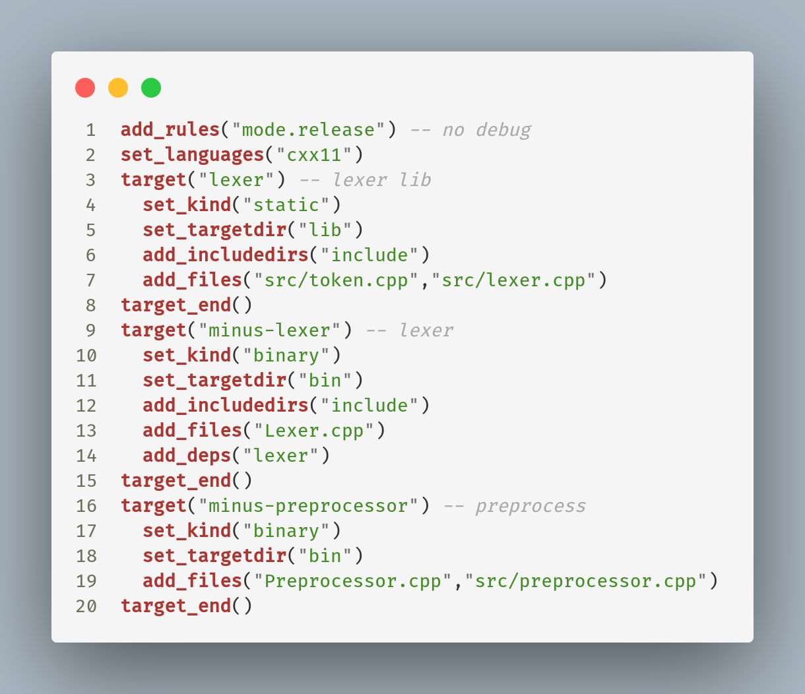
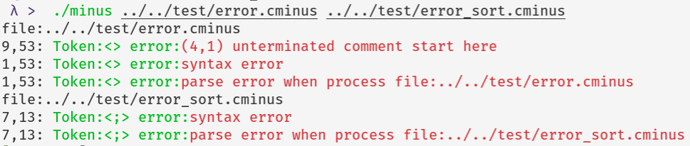

## 1. 课程设计目标

本次编译原理课程设计总共完成的内容如下表

| 模块                   | 功能                                                      | 使用的工具/编程语言 |
| ---------------------- | --------------------------------------------------------- | ------------------- |
| 预处理器(preprocessor) | 用相同长度的空格替换注释                                  | C++                 |
| 手工实现的扫描器       | 分析输入的源文件为带位置信息的token序列并输出(可处理注释) | CMake/xmake/C++     |
| Flex自动生成的扫描器   | 分析输入的源文件为带位置信息的token序列(可处理注释)       | flex/C              |
| Bison自动生成的分析器  | 根据语法规则将token序列转化为语法树并输出                 | Bison/C             |
| Bison语义动作生成器    | 根据Bison使用的BNF语法规则，自动生成所需的语义动作        | Python              |


## 2. 分析与设计

### 预处理器

使用预读和顺序处理的方法，维护column和row两个变量，记录位置信息以便在注释出错时（注释未关闭）输出位置信息。如果预处理无误，则预处理器会将更改写回到源文件，否则将报错并定位。

### 扫描器

#### DFA

各部分的DFA和整体的DFA展示如下，关键字在手工词法分析时被认为是id，在id匹配完后再判断是否为关键字；但在flex自动生成的扫描器中直接被分析出来。


整体的DFA。


#### flex

扫描器同时使用lex的GNU GPL开源版本实现：flex来完成，主要内容定义如下。

flex的默认输入为`stdin`，可以通过更改宏`yyin`定义或者调用`yyrestart`函数来实现，这里通过命令行参数所指定的文件来更改flex的读取文件。

可以通过修改宏`debug`来控制是否输出识别的token。

```c
%option noyywrap nodefault yylineno
%x COMMENT
id [a-zA-Z]+
num [0-9]+
relop ([<>]=?)|([=!]=)
addop [+-]
mulop [*/]

%%

if      {printToken("keyword",yytext,yylineno,column);column+=2;yylval.id=newlex(yytext);return IF;}
else    {printToken("keyword",yytext,yylineno,column);column+=4;yylval.id=newlex(yytext);return ELSE;}
return  {printToken("keyword",yytext,yylineno,column);column+=6;yylval.id=newlex(yytext);return RETURN;}
void    {printToken("keyword",yytext,yylineno,column);column+=4;yylval.id=newlex(yytext);return VOID;}
int     {printToken("keyword",yytext,yylineno,column);column+=3;yylval.id=newlex(yytext);return INT;}
while   {printToken("keyword",yytext,yylineno,column);column+=5;yylval.id=newlex(yytext);return WHILE;}

{addop} {printToken("op",yytext,yylineno,column);++column;              yylval.id=newlex(yytext);return addop;}
{mulop} {printToken("op",yytext,yylineno,column);++column;              yylval.id=newlex(yytext);return mulop;}
{relop} {printToken("op",yytext,yylineno,column);column+=strlen(yytext);yylval.id=newlex(yytext);return relop;}

"{" {printToken("braket",yytext,yylineno,column);     ++column;yylval.id=newlex(yytext);return LL;}
"}" {printToken("braket",yytext,yylineno,column);     ++column;yylval.id=newlex(yytext);return RL;}
"[" {printToken("braket",yytext,yylineno,column);     ++column;yylval.id=newlex(yytext);return LM;}
"]" {printToken("braket",yytext,yylineno,column);     ++column;yylval.id=newlex(yytext);return RM;}
"(" {printToken("braket",yytext,yylineno,column);     ++column;yylval.id=newlex(yytext);return LS;}
")" {printToken("braket",yytext,yylineno,column);     ++column;yylval.id=newlex(yytext);return RS;}

";" {printToken("SemiComma",yytext,yylineno,column);  ++column;yylval.id=newlex(yytext);return SEMI;}
"=" {printToken("Assign",yytext,yylineno,column);     ++column;yylval.id=newlex(yytext);return ASS;}
"," {printToken("Comma",yytext,yylineno,column);      ++column;yylval.id=newlex(yytext);return COMMA;}
"/*"  {
  cline = yylineno; ccol = column;
  column+=2;
  BEGIN(COMMENT);
}
<COMMENT>"*/" {column+=2;BEGIN(INITIAL);}
<COMMENT>[^*\n]+ {column+=strlen(yytext);}
<COMMENT>\n+ {column=1;}
<COMMENT>. {column+=1;}
<COMMENT><<EOF>> {
  yyerror("(%d,%d) unterminated comment start here",cline,ccol);
  BEGIN(INITIAL);
  yylineno = 1;
  return 0;
}

{id}  {printToken("id",yytext,yylineno,column); column+=strlen(yytext);yylval.id=newlex(yytext);return ID;}
{num} {printToken("num",yytext,yylineno,column);column+=strlen(yytext);yylval.id=newlex(yytext);return NUM;}
\n {column = 1;}
. {++column;}
```

#### 手工

手工的扫描器大量使用预读的方式来判断token的类型。

```cpp
class Lexer{
    ...
public:
    ...
    size_t getId(size_t start);
    size_t getOp(size_t start);
    size_t getNum(size_t start);  
};
```

然后再直接获取到一整个token。

此外还记录括号匹配信息和位置信息，方便定位和提前检查出不匹配的信息。

```cpp
size_t row,col;
size_t sb,mb,bb; // () [] {} the count of diff brakets
```


### 分析器

使用Yacc的GNU升级版本Bison完成自动生成。

所使用的BNF规则较初始版本有一点小的改动，改动后的结果如下

```bnf
program ::= decl_list
decl_list ::= decl decl_list| decl
decl ::= var_decl|func_decl
var_decl ::= type_spec var ;
type_spec ::= int | void
func_decl ::= type_spec ID (params) compound_stmt
params ::= params_list | void
params_list ::= param,params_list|param
param ::= type_spec param_suff
param_suff ::= ID|ID []
compound_stmt ::= { local_decls stmt_list }
local_decls ::= empty|var_decl local_decls
stmt_list ::= empty|stmt stmt_list
stmt ::= expr_stmt | compound_stmt | select_stmt | iter_stmt | ret_stmt
expr_stmt ::= expr ; | ;
select_stmt ::= if (expr) stmt else_stmt
else_stmt ::= empty | else stmt
iter_stmt ::= while(expr)stmt
ret_stmt ::= return expr_stmt
expr ::= var = expr|simple_expr
var ::= ID | ID [expr]
simple_expr ::= add_expr relop add_expr | add_expr
relop ::= <= | < | > | >= | == | !=
add_expr ::= add_expr addop term|term
addop ::= +|-
term ::= term mulop factor|factor
mulop ::= /|*
factor ::= (expr)|var|call|NUM
call ::= ID(args)
args ::= empty|arg_list
arg_list ::= expr,arg_list|expr
```

bison版本的bnf文法如下：

```bnf
program : decl_list
  ;
  decl_list : decl
  | decl decl_list
  ;
decl : var_decl 
  | func_decl 
  ;
var_decl : type_spec var SEMI
  ;
type_spec : INT 
  | VOID 
  ;
func_decl : type_spec ID LS params RS compound_stmt 
  ;
params : params_list 
  | VOID 
  ;
params_list : param COMMA params_list
  | param 
  ;
param : type_spec param_suff 
  ;
param_suff : ID 
  | ID LM RM 
  ;
compound_stmt : LL local_decls stmt_list RL
  ;
local_decls :| var_decl local_decls
  ;
stmt_list :| stmt stmt_list
  ;
stmt : expr_stmt
  | compound_stmt
  | select_stmt
  | iter_stmt
  | ret_stmt
  ;
expr_stmt : expr SEMI
  | SEMI
  ;
select_stmt : IF LS expr RS stmt else_stmt
  ;
else_stmt :| ELSE stmt
  ;
iter_stmt : WHILE LS expr RS stmt
  ;
ret_stmt : RETURN expr_stmt
  ;
expr : simple_expr
  |var ASS expr
  ;
var : ID 
  | ID LM expr RM
  ;
simple_expr : add_expr
  |add_expr relop add_expr
  ;
add_expr : term
  |add_expr addop term
  ;
term : factor
  |term mulop factor
  ;
factor : NUM
  |LS expr RS
  |var
  |call
  ;
call : ID LS args RS 
  ;
args :|arg_list
  ;
arg_list : expr COMMA arg_list
  |expr
  ;
```


bison的获取token的方式是调用`yylex()`，如果在C++模式可以很好的更改。

bison没有默认的输出，只是负责完成语法树的构建，具体的语义动作需要自己通过编程代码来实现。因为实现要求为输出语法树，所以实现的语义动作为抽象语法树的构建。

因为除去第一条规则外，其他语义动作都比较一致，如下面演示代码。

```c
program : decl_list {
    $$ = newast(NoT,1,"program -> decl_list",$1);
    show_ast($$);
    astfree($$);
  }
  ;
decl_list : decl{$$=newast(NoT,1,"decl_list -> decl",$1);}
  | decl decl_list{$$=newast(NoT,2,"decl_list-> decl decl_list",$1,$2);}
  ;
```

所以使用Python编写脚本代码来根据bison格式的BNF文法自动生成语义动作。

脚本的核心处理在于下面这个函数

```Python
def add_rule(pat:str,parts:list)->str:
  return f"{{$$=newast(NoT,{len(parts)},\"{pat.lower()}\",{','.join([wrap_lexeme(lex,i+1) for i,lex in enumerate(parts)])});}}"
```


### 系统总图

圆形节点为输入输出数据节点，矩形节点为各模块。

在使用flex/bison时，没有使用纯分析模式，所以bison和flex存在数据耦合，flex生成扫描器时需要bison定义的符号，bison生成的分析器会实时调用flex扫描器的`yylex()`函数以实时获取token来进行`LALR(1)`分析。


#### 构建系统

因为文件较多，不可能每次都进行手动指令编译，于是选择了一些构建系统来完成构建所要完成的动作。

对于手工实现的部分，可以通过xmake或者CMake来构建。

具体使用和构建见 README

xmake所依赖的文件为`xmake.lua` CMake依赖的文件为`CMakeLists.txt`

对于flex/bison部分，因为xmake构建规则比较麻烦，所以选择直接使用Makefile来构建这个模块。

### 代码设计说明

#### 程序框架

```
├── CMakeLists.txt
├── c-minus.bnf
├── flex_bison
│   ├── C
│   │   ├── Makefile
│   │   ├── minus.bison.bnf
│   │   ├── minus.h
│   │   ├── minus.head.y
│   │   ├── minus_impl.c
│   │   ├── minus.l
│   │   ├── minus.y
│   │   ├── preprocess.bnf.bison.py
│   │   └── xmake.lua
├── include
│   ├── lexer.h
│   └── token.h
├── Lexer.cpp
├── lib
│   └── liblexer.a
├── main.cpp
├── Preprocessor.cpp
├── README.md
├── src
│   ├── lexer.cpp
│   ├── preprocessor.cpp
│   └── token.cpp
├── test
│   ├── err.c
│   ├── error.cminus
│   ├── error_sort.cminus
│   ├── gcd.cminus
│   ├── hello.cminus
│   ├── main.cpp
│   ├── pass_pre.c
│   ├── s.cminus
│   └── sort.cminus
└── xmake.lua
```

#### 文件和函数及关键数据结构

##### 手工

手工实现的扫描器的主要文件在于

```
├── include
│   ├── lexer.h
│   └── token.h
├── Lexer.cpp
├── Preprocessor.cpp
├── src
│   ├── lexer.cpp
│   ├── preprocessor.cpp
│   └── token.cpp
└── xmake.lua
```

关键数据结构在于定义的两个类

```cpp
// token.h
enum class Type:short{
  id,keyword,number,op,error
};

struct Token{
  using str=std::string;
  Type type;
  str name;
  size_t line,col;
  Token(const str&source,Type _t,size_t lc,size_t cc)
      :name(source),type(_t),line(lc),col(cc){}
  str to_string(bool detail=false)const noexcept;
  bool is_keyword(bool modify=true);
  static char next_op(char ch){
    static std::unordered_map<char,char> op_table{
      {'<','='},{'>','='},{'=','='},{'!','='}
    };
    try{
      return op_table.at(ch);
    }catch(const std::out_of_range&){return 0;}
  }
  static bool invalid_op(char ch){
    static std::set<char> invalid_singles{'!'};
    return invalid_singles.count(ch);
  }
  static Type token_type(char ch){
    static std::set<char> valid_ops{
      '<','>','*','=','+','-','/',';',',',
      '(',')','[',']','{','}'
    };
    /**
     * id::= [a-zA-Z]+
     * num::= [0-9]+
     * sop::= [+-/*<>=;,()[]{}]
     * dop::= <=|>=|==|!=|/* /
    */
    if(isalpha(ch)!=0){return Type::id;}
    else if(ch>='0'&&ch<='9'){return Type::number;}
    else if(valid_ops.count(ch)){return Type::op;}
    else return Type::error;
  }
};

// lexer.h
class Lexer{
  using str=std::string;
  str source;
  bool debug_mode;
  size_t row,col;
  size_t sb,mb,bb; // () [] {} the count of diff brakets
  std::vector<Token> tokens;
  /**
   * @brief skip the comment
   * @param slash start position of left slash
   * @return the length of comment (the offset)
   * @exception runtime_error if occurs an open comment
  */
  size_t skip_comment(size_t slash);
  bool isbraket(char ch,bool process=true);
  void reset();
  inline Token get_token(str const&,Type);
  inline void push_token(const Token&);
  inline void push_token(str const&,Type);
public:
  Lexer(bool debug=false):row(1),col(1),sb(0),mb(0),bb(0),debug_mode(debug){}
  Lexer& load_file(const str&file);
  Lexer& load_code(const str&code);
  std::vector<Token> execute(bool debug=false);
  Lexer& set_mode(bool debug_mode);
  # pragma region token getter
  /**
   * @brief the same funtion as @skip_comment
   * @return offset
  */
  size_t getId(size_t start);
  size_t getOp(size_t start);
  size_t getNum(size_t start);
  # pragma endregion
  inline static str gen_err_msg(size_t row,size_t col,str const&msg){
    return "Line: "+std::to_string(row)+
            " Col: "+std::to_string(col)+
            "\terror msg:"+msg;
  }
  inline str gen_err_msg(str const&msg){return gen_err_msg(row,col,msg);}
};
```

> 手工实现的扫描器可以通过[`xmake`](https://github.com/xmake-io/xmake/)或者`CMake`构建

##### 自动

自动生成部分选择flex和bison来共同完成词法分析和语法分析，可以通过宏的使用来控制词法分析过程是否输出token，还可以控制语法树输出时是否输出产生式。

> flex/bison自动生成部分通过makefile完成构建

关键数据结构和函数定义如下:

```c
/* minus.y */
enum TokenType{
  NoT,Id,Keyword,Num,Sign,Op
};
/* minus_impl.c */
struct lex{
  char*val;
  unsigned len;
};

struct ast{
  int type,node_cnt;
  const char* value;
  struct ast* childen[];
};
#define LEX 1
#if LEX == 1
struct lex* newlex(const char*);
struct ast* newterm(int type, struct lex* val);
#else
struct ast* newterm(int type, const char* val);
#endif
void show_ast(struct ast*);
void astfree(struct ast*);
```

在抽象语法树构建时通过type字段区分终结符与非终结符。


## 3. 程序代码实现

### Preprocessor

```cpp
bool preprocess(const std::string&,std::string&); // 声明函数

int main(int argc,char* argv[]){
  std::string error;
  for(int i=1;i<argc;++i){
    if(!preprocess(argv[i],error)){
      std::cerr<<argv[i]<<": preprocessing error|msg:\033[31m"<<error<<"\033[0m"<<std::endl;
      return 1;
    }
  }
  return 0;
}

// preprocessor.cpp
bool preprocess(const std::string& filename, std::string& msg) {
  std::ifstream src(filename);
  if (!src.good()) {
    msg = "file not exists";
    return false;
  }
  std::string cache((std::istreambuf_iterator<char>(src)),
                    std::istreambuf_iterator<char>());
  src.close();
  int start, end, col = 0, row = 0;
  int sc, sr;  // start point row/col
  bool flag = false;
  for (size_t i = 0; i < cache.size(); ++i) {
    if (cache[i] == '/') {
      if (i + 1 < cache.size() && cache[i + 1] == '*') {
        if (!flag) {
          flag = true;
          start = i++;  // step one
          sc = col;
          sr = row;
        }
      }
    } else if (cache[i] == '*') {
      if (i + 1 < cache.size() && cache[i + 1] == '/') {
        if (flag) {
          flag = false;
          end = ++i + 1;  // step one too
          spacing(cache, start, end);
        }
      }
    }
    if (cache[i] == '\n') {
      ++row;
      col = 1;
    } else {
      ++col;
    }
  }
  if (flag) {
    msg = "row:" + std::to_string(sr) + " col:" + std::to_string(sc) +
          "\t open comment";
    return false;
  } else {
    std::ofstream dst(filename);
    dst << cache;
    dst.close();
    return true;
  }
}
```

### Lexer-手工

手工实现的扫描器分为了两个部分：token和lexer，token主要定义和识别每个词，并在此完成关键词的识别。

```cpp
// token.cpp
namespace values{
  using std::unordered_map;
  static unordered_map<Type,std::string> t2n={
    {Type::id,"id"},
    {Type::keyword,"keyword"},
    {Type::number,"number"},
    {Type::op,"operator"}
  };
  static unordered_map<std::string,Type> n2t={
    {"id",Type::id},
    {"keyword",Type::keyword},
    {"number",Type::number},
    {"operator",Type::op}
  };
  static std::set<std::string>keywords{
    "if","else","int","return","void","while"
  };
}
```

lexer主要定义来用户接口部分和token的获取。下面是一些主要的成员函数。

```cpp
// 执行词法分析的入口
std::vector<Token> Lexer::execute(bool debug) {
  debug_mode = debug;
  if (tokens.size() != 0) return tokens;
  for (size_t scan = 0; scan < source.size();) {
    if (isspace(source[scan])) {  // skip space
      if (source[scan] == '\n') {
        ++row;col = 1;
      } else { ++col; }
      ++scan; continue;  // end this pass
    }
      // 预读判断下一个token的类型
    switch (Token::token_type(source[scan])) {
      case Type::id: {
        scan += getId(scan);
        break;
      }
      case Type::number: {
        scan += getNum(scan);
        break;
      }
      case Type::op: {
        scan += getOp(scan);
        break;
      }
      default: {  // error here
        // invalid char
        throw std::runtime_error(gen_err_msg(row, col, "invalid char"));
      }
    }
  }
  if(sb||mb||bb){ // 判定括号是否匹配
    throw std::runtime_error(gen_err_msg(row, col, "brakets not match"));
  }
  return tokens;
}
```

对符号分类后，主要有三类token：id、num和符号，通过在预读时的类型判断后，直接读取整个token。当读取token出错时，直接抛出具有具体错误信息的`runtime_error`。

```cpp
#pragma region token getter
size_t Lexer::getId(size_t start) {
  // end if op or space occur
  size_t eoi = source.size();
  for (size_t i = start; i < eoi; ++i) {
    if (!isalpha(source[i])) {  // end of id here
      if (isdigit(source[i])) {
        throw std::runtime_error(gen_err_msg("invalid identifier with number"));
      } else {
        eoi = i;
      }
    }
  }
  eoi -= start;
  Token tk{source.substr(start, eoi), Type::id, row, col};
  col += eoi;  // steps after push
  tk.is_keyword();
  push_token(tk);
  return eoi;
}
size_t Lexer::getOp(size_t start) {
  // process comment here
  size_t offset;
  if (source[start] == '/' && start + 1 < source.size() &&
      source[start + 1] == '*') {
    offset = skip_comment(start); // 处理注释
  } else if (isbraket(source[start])) {
    offset = 1;
  } else {  // other operators
    if (Token::next_op(source[start])) {
      push_token(source.substr(start, 2), Type::op);
      offset = 2;
    } else {
      if (Token::invalid_op(source[start])) {
        throw std::runtime_error(gen_err_msg("invalid operator"));
      }
      push_token(str(1, source[start]), Type::op);
      offset = 1;
    }
  }
  col += offset;
  return offset;
}
size_t Lexer::getNum(size_t start) {
  size_t eoi = source.size();
  for (size_t i = start; i < eoi; ++i) {
    if (!isdigit(source[i])) {
      if (isalpha(source[i])) {
        throw std::runtime_error(gen_err_msg("invalid number with char"));
      } else {
        eoi = i;
      }
    }
  }
  eoi -= start;
  Token tk{source.substr(start, eoi), Type::number, row, col};
  col += eoi;
  push_token(tk);
  return eoi;
}
#pragma endregion
```

### Lexer-Flex

该部分过于简单，[前文](#flex)已经基本展示完毕，这里只展示输出控制的宏定义控制。

```c
#define debug 0
void printToken(const char*,const char*,int,int);
/* ... */
void printToken(const char*type,const char*val,int row,int col){
  if(debug){
    printf("%s:<%s> (%d,%d)\n",type,val,row,col);
  }
}
```


### Bison-预处理

Bison的预处理一共有三个部分

1. 把原始的BNF转为Bison的BNF格式，很简单，可以直接编辑器的替换功能完成（可以并入下一步）
2. 使用Python脚本编写每条规则的语义动作，这部分因为抽象语法结构定义的比较简单，导致这部分基本是相当一致的动作，可以通过脚本来实现每条规则的相关语义动作的编写。
3. 对第一条规则做适当的代码修改并编写非语法规则代码。

Python脚本的主要工作为

1. 以行为单位抽取出每条完整的产生式
2. 判断产生式各部分的类型（非终结符，不同类型的非终结符）
3. 生成产生式的语义动作
4. 后处理一些特殊的产生式（如$\epsilon$产生式）和符号

最后执行脚本，手动重定向就完成来Bison预处理的第二步。

```Python
from typing import List

head = ""
def judge_type(line:str)->int:
  """
  0 - first line
  1 - | line
  2 - ; line
  """
  if line[0].isalpha():
    return 0
  else: return 1 if '|' in line else 2
def wrap_lexeme(lex:str,idx:int)->str:
  t = "Sign"
  if "op" in lex:
    t = "Op"
  if lex == "ID":
    t = "Id"
  if lex.isupper() or "op" in lex:
      return f"newterm({t},${idx})"
  else: return f"${idx}"
def add_rule(pat:str,parts:list)->str:
  return f"{{$$=newast(NoT,{len(parts)},\"{pat.lower()}\",{','.join([wrap_lexeme(lex,i+1) for i,lex in enumerate(parts)])});}}"
def modify(s:str)->str:
    “”“
    获取产生式并添加语义动作
    ”“”
  _t = judge_type(s)
  global head
  if _t == 1:
    st = s.find('|')
    last = s[st+1:-1]
    pat = head+"->"+last
    return s[:-1]+add_rule(pat,[p.strip() for p in last.split(' ') if p.strip()!=''])
  elif _t == 0:
    head = s[:s.find(' ')]
    pat = s.replace(':',"->")[:-1]
    pat = pat.replace(":|",':')
    st = s.find(':')
    return s[:-1]+add_rule(pat,[p.strip() for p in s[st+1:-1].split(' ') if p.strip()!=''])
  return s
def add_actions(filename:str)->List[str]:
  with open(filename,mode="r") as fd:
    content = fd.readlines()
  # _t = judge_type()
  content = [modify(line) for line in content]
  return content
table = {
  " semi":" ;",
  " comma":" ,",
  " ll":" {",
  " rl":" }",
  " lm":" [",
  " rm":" ]",
  " ls":" (",
  " rs":" )",
  " ass":" =",
  "->|":"-> empty|",
  ":|":":{$$=NULL;}|"
}
def post_wrap(l:str)->str:
  for k,v in table.items():
    l=l.replace(k,v)
  return l
def post_pro(l:List[str])->List[str]:
  return [post_wrap(line) for line in l]
if __name__ == "__main__":
  [print(line) for line in post_pro(add_actions("minus.bison.bnf"))]
```

对于bison中符号的定义以及值类型的定义


### Parser-Bison

在预处理后Bison这部分就已经完成了，只需要管理好工具的使用和编译就没有问题了。

此外对于输出格式的控制在于两个宏`PARSE_DEBUG`和`PARSE_RULE`，前者控制抽象语法树（ast）构建的信息输出，后者控制语法树输出时，是否输出产生式。

```c
#define PARSE_DEBUG 0
/* ... */
void show_ast_helper(struct ast* root, int it) {
  if (root != NULL) {
    // printf("%d. ", ++seq);
    int t_sum = 0;
    for (int i = 0; i < root->node_cnt; ++i) {
      if (root->childen[i]) {
        t_sum += root->childen[i]->type;
      }
    }
#ifdef PARSE_RULE
    Indent(stdout, it);
#endif
    if (root->type) {
#ifndef PARSE_RULE
      Indent(stdout, it - 1);
#endif
      printf("%s\n", root->value);
    } else {
#ifdef PARSE_RULE
      printf("<\033[34m%s\033[0m>\n", root->value);
#endif
      int n = t_sum == 0 ? it : it + 1;
      for (int i = 0; i < root->node_cnt; ++i) {
        show_ast_helper(root->childen[i], n);
      }
    }
  }
}
```

### 构建系统

本次课程设计的另一大特点在于使用了多种构建系统。

| 构建系统 | 管理模块                                         |
| -------- | ------------------------------------------------ |
| xmake    | preprocessor lexer（作为手工实现的主要构建系统） |
| CMake    | lexer（后续预处理器时未更新）                    |
| makefile | flex/bison lexer/parser                          |

#### xmake

xmake可以直接作为直接的构建系统，构建后直接产生目标文件，较之CMake，文档和lua脚本语言的语法更友好，所以手动实现时选择了该构建系统。



#### CMake

```cmake
cmake_minimum_required(VERSION 3.0)
project(clexer)

set(source src/lexer.cpp src/token.cpp)

include_directories(include)
add_executable(lexer Lexer.cpp ${source})
```

CMake是二级构建系统，它并不能直接完成目标的构建，而是生成低级构建系统的代码，比如ninja和makefile。

#### makefile

对于flex和bison两个工具的使用上，不管是需要自定义规则的xmake还是高级构建系统的CMake，都不如有自动推导规则的Makefile好用。

Makefile对于flex和bison的编译推导有支持，所以在定义`YFLAGS`标志（yacc/bison的生成标志）后，可以利用自动推导规则。

```makefile
cc=clang
cpp=clang++
lflag=-+
lang=c
YFLAGS=-L ${lang} -d

objs=minus.o minus.lex.o  minus_impl.o

minus: ${objs}
	${cc} -o $@ ${objs}
minus_rule: ${objs}
	${cc} -c -o minus_impl.o -D PARSE_RULE minus_impl.c
	${cc} -o $@ ${objs}
minus.tab.c: minus.y minus.h
minus.lex.o: minus.lex.c
minus.lex.c: minus.l minus.h
	lex -o $@ $<
minus_impl.o: minus_impl.c
minus.o: minus.c
.PHONY:clean
clean:
	-@rm *lex.c* *.tab.* *.o minus.c minus minus_rule
```


## 4. 测试结果

给出标准测试程序的词法和语法分析结果：
1. 对正确的测试源程序进行词法和语法分析，给出分析结果
2. 对错误的测试程序进行分析，报错给出错误性质、位置等信息
  词法分析和语法分析的结果输出，可以是结果输出文件也可以是程序运行的截图。

准备如下四份样例代码

1. 正确的代码

```c
int gcd (int u, int v)
{ if (v == 0) return u ;
else return gcd(v,u-u/v*v);
/* u-u/v*v == u mod v 
*/
}
void main(void)
{ int x; int y;
x = input(); y = input();output ( gcd ( x , y ) ) ;}
```

2. 正确的代码

```c
int x[10];
int minloc(int a[], int low, int high) {
  int i;
  int x;
  int k;
  k = low;
  x = a[low];
  i = low + 1;
  while (i < high) {
    if (a[i] < x) {
      x = a[i];
      k = i;
    }
    i = i + 1;
  }
  return k;
}
void sort(int a[], int low, int high) {
  int i;
  int k;
  i = low;
  while (i < high - 1) {
    int t;
    k = minloc(a, i, high);
    t = a[k];
    a[k] = a[i];
    a[i] = t;
    i = i + 1;
  }
}
void main(void) {
  int i;
  i = 0;
  while (i < 10) {
    x[i] = input;
    i = i + 1;
    sort(x, 0, 10);
    i = 0;
    while (i < 10) {
      output(x[i]);
      i = i + 1;
    }
  }
}
```

3. 对应的 1 的错误代码： 未关闭的注释

```c
int gcd (int u, int v)
{ if (v == 0) return u ;
else return gcd(v,u-u/v*v);
/* u-u/v*v == u mod v 
*
}
void main(void)
{ int x; int y;
x = input(); y = input();output ( gcd ( x , y ) ) ;}
```

4. 对应的 2 的错误代码： 第7行数组赋值错误

```c
int x[10];
int minloc(int a[], int low, int high) {
  int i;
  int x;
  int k;
  k = low;
  x = a[low;
  i = low + 1;
  while (i < high) {
    if (a[i] < x) {
      x = a[i];
      k = i;
    }
    i = i + 1;
  }
  return k;
}
void sort(int a[], int low, int high) {
  int i;
  int k;
  i = low;
  while (i < high - 1) {
    int t;
    k = minloc(a, i, high);
    t = a[k];
    a[k] = a[i];
    a[i] = t;
    i = i + 1;
  }
}
void main(void) {
  int i;
  i = 0;
  while (i < 10) {
    x[i] = input;
    i = i + 1;
    sort(x, 0, 10);
    i = 0;
    while (i < 10) {
      output(x[i]);
      i = i + 1;
    }
  }
}
```


### 正确样例

#### 1

词法分析结果

```
<'int',keyword,(1,1)>
<'gcd',id,(1,5)>
<'(',operator,(1,9)>
<'int',keyword,(1,10)>
<'u',id,(1,14)>
<',',operator,(1,15)>
<'int',keyword,(1,17)>
<'v',id,(1,21)>
<')',operator,(1,22)>
<'{',operator,(2,1)>
<'if',keyword,(2,3)>
<'(',operator,(2,6)>
<'v',id,(2,7)>
<'==',operator,(2,9)>
<'0',number,(2,12)>
<')',operator,(2,13)>
<'return',keyword,(2,15)>
<'u',id,(2,22)>
<';',operator,(2,24)>
<'else',keyword,(3,1)>
<'return',keyword,(3,6)>
<'gcd',id,(3,13)>
<'(',operator,(3,16)>
<'v',id,(3,17)>
<',',operator,(3,18)>
<'u',id,(3,19)>
<'-',operator,(3,20)>
<'u',id,(3,21)>
<'/',operator,(3,22)>
<'v',id,(3,23)>
<'*',operator,(3,24)>
<'v',id,(3,25)>
<')',operator,(3,26)>
<';',operator,(3,27)>
<'}',operator,(6,1)>
<'void',keyword,(7,1)>
<'main',id,(7,6)>
<'(',operator,(7,10)>
<'void',keyword,(7,11)>
<')',operator,(7,15)>
<'{',operator,(8,1)>
<'int',keyword,(8,3)>
<'x',id,(8,7)>
<';',operator,(8,8)>
<'int',keyword,(8,10)>
<'y',id,(8,14)>
<';',operator,(8,15)>
<'x',id,(9,1)>
<'= ',operator,(9,3)>
<'input',id,(9,5)>
<'(',operator,(9,10)>
<')',operator,(9,11)>
<';',operator,(9,12)>
<'y',id,(9,14)>
<'= ',operator,(9,16)>
<'input',id,(9,18)>
<'(',operator,(9,23)>
<')',operator,(9,24)>
<';',operator,(9,25)>
<'output',id,(9,26)>
<'(',operator,(9,33)>
<'gcd',id,(9,35)>
<'(',operator,(9,39)>
<'x',id,(9,41)>
<',',operator,(9,43)>
<'y',id,(9,45)>
<')',operator,(9,47)>
<')',operator,(9,49)>
<';',operator,(9,51)>
<'}',operator,(9,52)>
```

语法分析结果

```
  int
gcd
(
    int
    u
  ,
    int
    v
)
  {
    if
    (
        v
      ==
        0
    )
      return
          u
        ;
      else
        return
            gcd
            (
                v
              ,
                  u
                -
                      u
                    /
                      v
                  *
                    v
            )
          ;
          v
        ,
            u
          -
                u
              /
                v
            *
              v
  }
  void
main
(
  void
)
  {
      int
      x
    ;
      int
      y
    ;
        x
      =
        input
        (
        )
    ;
        y
      =
        input
        (
        )
    ;
      output
      (
        gcd
        (
            x
          ,
            y
        )
      )
    ;
  }
```

带有产生式规则的语法树部分结果


#### 2

第二个示例代码的抽象语法树

```
  int
  x
  [
    10
  ]
;
  int
minloc
(
    int
    a
    [
    ]
  ,
      int
      low
    ,
      int
      high
)
  {
      int
      i
    ;
      int
      x
    ;
      int
      k
    ;
        k
      =
        low
    ;
        x
      =
        a
        [
          low
        ]
    ;
        i
      =
          low
        +
          1
    ;
    while
    (
        i
      <
        high
    )
      {
        if
        (
            a
            [
              i
            ]
          <
            x
        )
          {
                x
              =
                a
                [
                  i
                ]
            ;
                k
              =
                i
            ;
          }
            i
          =
              i
            +
              1
        ;
      }
    return
        k
      ;
  }
  void
sort
(
    int
    a
    [
    ]
  ,
      int
      low
    ,
      int
      high
)
  {
      int
      i
    ;
      int
      k
    ;
        i
      =
        low
    ;
    while
    (
        i
      <
          high
        -
          1
    )
      {
          int
          t
        ;
            k
          =
            minloc
            (
                a
              ,
                  i
                ,
                  high
            )
        ;
            t
          =
            a
            [
              k
            ]
        ;
            a
            [
              k
            ]
          =
            a
            [
              i
            ]
        ;
            a
            [
              i
            ]
          =
            t
        ;
            i
          =
              i
            +
              1
        ;
      }
  }
  void
main
(
  void
)
  {
      int
      i
    ;
        i
      =
        0
    ;
    while
    (
        i
      <
        10
    )
      {
            x
            [
              i
            ]
          =
            input
        ;
            i
          =
              i
            +
              1
        ;
          sort
          (
              x
            ,
                0
              ,
                10
          )
        ;
            i
          =
            0
        ;
        while
        (
            i
          <
            10
        )
          {
              output
              (
                x
                [
                  i
                ]
              )
            ;
                i
              =
                  i
                +
                  1
            ;
          }
      }
  }
```


### 错误样例

#### 3

词法分析错误

```
<'int',keyword,(1,1)>
<'gcd',id,(1,5)>
<'(',operator,(1,9)>
<'int',keyword,(1,10)>
<'u',id,(1,14)>
<',',operator,(1,15)>
<'int',keyword,(1,17)>
<'v',id,(1,21)>
<')',operator,(1,22)>
<'{',operator,(2,1)>
<'if',keyword,(2,3)>
<'(',operator,(2,6)>
<'v',id,(2,7)>
<'==',operator,(2,9)>
<'0',number,(2,12)>
<')',operator,(2,13)>
<'return',keyword,(2,15)>
<'u',id,(2,22)>
<';',operator,(2,24)>
<'else',keyword,(3,1)>
<'return',keyword,(3,6)>
<'gcd',id,(3,13)>
<'(',operator,(3,16)>
<'v',id,(3,17)>
<',',operator,(3,18)>
<'u',id,(3,19)>
<'-',operator,(3,20)>
<'u',id,(3,21)>
<'/',operator,(3,22)>
<'v',id,(3,23)>
<'*',operator,(3,24)>
<'v',id,(3,25)>
<')',operator,(3,26)>
<';',operator,(3,27)>
in ../test/error.cminus Line: 4 Col: 1  error msg:the start position of an open comment
```


#### 4

词法分析的结果信息：手工实现的能在分析结束后识别到括号不匹配错误

```
<'int',keyword,(1,1)>
<'x',id,(1,5)>
<'[',operator,(1,6)>
<'10',number,(1,7)>
<']',operator,(1,9)>
<';',operator,(1,10)>
<'int',keyword,(2,1)>
<'minloc',id,(2,5)>
<'(',operator,(2,11)>
<'int',keyword,(2,12)>
<'a',id,(2,16)>
<'[',operator,(2,17)>
<']',operator,(2,18)>
<',',operator,(2,19)>
<'int',keyword,(2,21)>
<'low',id,(2,25)>
<',',operator,(2,28)>
<'int',keyword,(2,30)>
<'high',id,(2,34)>
<')',operator,(2,38)>
<'{',operator,(2,40)>
<'int',keyword,(3,3)>
<'i',id,(3,7)>
<';',operator,(3,8)>
<'int',keyword,(4,3)>
<'x',id,(4,7)>
<';',operator,(4,8)>
<'int',keyword,(5,3)>
<'k',id,(5,7)>
<';',operator,(5,8)>
<'k',id,(6,3)>
<'= ',operator,(6,5)>
<'low',id,(6,7)>
<';',operator,(6,10)>
<'x',id,(7,3)>
<'= ',operator,(7,5)>
<'a',id,(7,7)>
<'[',operator,(7,8)>
<'low',id,(7,9)>
<';',operator,(7,12)>
<'i',id,(8,3)>
<'= ',operator,(8,5)>
<'low',id,(8,7)>
<'+',operator,(8,11)>
<'1',number,(8,13)>
<';',operator,(8,14)>
<'while',keyword,(9,3)>
<'(',operator,(9,9)>
<'i',id,(9,10)>
<'< ',operator,(9,12)>
<'high',id,(9,14)>
<')',operator,(9,18)>
<'{',operator,(9,20)>
<'if',keyword,(10,5)>
<'(',operator,(10,8)>
<'a',id,(10,9)>
<'[',operator,(10,10)>
<'i',id,(10,11)>
<']',operator,(10,12)>
<'< ',operator,(10,14)>
<'x',id,(10,16)>
<')',operator,(10,17)>
<'{',operator,(10,19)>
<'x',id,(11,7)>
<'= ',operator,(11,9)>
<'a',id,(11,11)>
<'[',operator,(11,12)>
<'i',id,(11,13)>
<']',operator,(11,14)>
<';',operator,(11,15)>
<'k',id,(12,7)>
<'= ',operator,(12,9)>
<'i',id,(12,11)>
<';',operator,(12,12)>
<'}',operator,(13,5)>
<'i',id,(14,5)>
<'= ',operator,(14,7)>
<'i',id,(14,9)>
<'+',operator,(14,11)>
<'1',number,(14,13)>
<';',operator,(14,14)>
<'}',operator,(15,3)>
<'return',keyword,(16,3)>
<'k',id,(16,10)>
<';',operator,(16,11)>
<'}',operator,(17,1)>
<'void',keyword,(18,1)>
<'sort',id,(18,6)>
<'(',operator,(18,10)>
<'int',keyword,(18,11)>
<'a',id,(18,15)>
<'[',operator,(18,16)>
<']',operator,(18,17)>
<',',operator,(18,18)>
<'int',keyword,(18,20)>
<'low',id,(18,24)>
<',',operator,(18,27)>
<'int',keyword,(18,29)>
<'high',id,(18,33)>
<')',operator,(18,37)>
<'{',operator,(18,39)>
<'int',keyword,(19,3)>
<'i',id,(19,7)>
<';',operator,(19,8)>
<'int',keyword,(20,3)>
<'k',id,(20,7)>
<';',operator,(20,8)>
<'i',id,(21,3)>
<'= ',operator,(21,5)>
<'low',id,(21,7)>
<';',operator,(21,10)>
<'while',keyword,(22,3)>
<'(',operator,(22,9)>
<'i',id,(22,10)>
<'< ',operator,(22,12)>
<'high',id,(22,14)>
<'-',operator,(22,19)>
<'1',number,(22,21)>
<')',operator,(22,22)>
<'{',operator,(22,24)>
<'int',keyword,(23,5)>
<'t',id,(23,9)>
<';',operator,(23,10)>
<'k',id,(24,5)>
<'= ',operator,(24,7)>
<'minloc',id,(24,9)>
<'(',operator,(24,15)>
<'a',id,(24,16)>
<',',operator,(24,17)>
<'i',id,(24,19)>
<',',operator,(24,20)>
<'high',id,(24,22)>
<')',operator,(24,26)>
<';',operator,(24,27)>
<'t',id,(25,5)>
<'= ',operator,(25,7)>
<'a',id,(25,9)>
<'[',operator,(25,10)>
<'k',id,(25,11)>
<']',operator,(25,12)>
<';',operator,(25,13)>
<'a',id,(26,5)>
<'[',operator,(26,6)>
<'k',id,(26,7)>
<']',operator,(26,8)>
<'= ',operator,(26,10)>
<'a',id,(26,12)>
<'[',operator,(26,13)>
<'i',id,(26,14)>
<']',operator,(26,15)>
<';',operator,(26,16)>
<'a',id,(27,5)>
<'[',operator,(27,6)>
<'i',id,(27,7)>
<']',operator,(27,8)>
<'= ',operator,(27,10)>
<'t',id,(27,12)>
<';',operator,(27,13)>
<'i',id,(28,5)>
<'= ',operator,(28,7)>
<'i',id,(28,9)>
<'+',operator,(28,11)>
<'1',number,(28,13)>
<';',operator,(28,14)>
<'}',operator,(29,3)>
<'}',operator,(30,1)>
<'void',keyword,(31,1)>
<'main',id,(31,6)>
<'(',operator,(31,10)>
<'void',keyword,(31,11)>
<')',operator,(31,15)>
<'{',operator,(31,17)>
<'int',keyword,(32,3)>
<'i',id,(32,7)>
<';',operator,(32,8)>
<'i',id,(33,3)>
<'= ',operator,(33,5)>
<'0',number,(33,7)>
<';',operator,(33,8)>
<'while',keyword,(34,3)>
<'(',operator,(34,9)>
<'i',id,(34,10)>
<'< ',operator,(34,12)>
<'10',number,(34,14)>
<')',operator,(34,16)>
<'{',operator,(34,18)>
<'x',id,(35,5)>
<'[',operator,(35,6)>
<'i',id,(35,7)>
<']',operator,(35,8)>
<'= ',operator,(35,10)>
<'input',id,(35,12)>
<';',operator,(35,17)>
<'i',id,(36,5)>
<'= ',operator,(36,7)>
<'i',id,(36,9)>
<'+',operator,(36,11)>
<'1',number,(36,13)>
<';',operator,(36,14)>
<'sort',id,(37,5)>
<'(',operator,(37,9)>
<'x',id,(37,10)>
<',',operator,(37,11)>
<'0',number,(37,13)>
<',',operator,(37,14)>
<'10',number,(37,16)>
<')',operator,(37,18)>
<';',operator,(37,19)>
<'i',id,(38,5)>
<'= ',operator,(38,7)>
<'0',number,(38,9)>
<';',operator,(38,10)>
<'while',keyword,(39,5)>
<'(',operator,(39,11)>
<'i',id,(39,12)>
<'< ',operator,(39,14)>
<'10',number,(39,16)>
<')',operator,(39,18)>
<'{',operator,(39,20)>
<'output',id,(40,7)>
<'(',operator,(40,13)>
<'x',id,(40,14)>
<'[',operator,(40,15)>
<'i',id,(40,16)>
<']',operator,(40,17)>
<')',operator,(40,18)>
<';',operator,(40,19)>
<'i',id,(41,7)>
<'= ',operator,(41,9)>
<'i',id,(41,11)>
<'+',operator,(41,13)>
<'1',number,(41,15)>
<';',operator,(41,16)>
<'}',operator,(42,5)>
<'}',operator,(43,3)>
<'}',operator,(44,1)>
in ../test/error_sort.cminus    Line: 44 Col: 2 error msg:brakets not match
```


两个错误样例的错误信息




## 5. 总结

### 收获

了解到一般编译型语言的编译过程，了解了预处理和词法分析的原理和实现，了解了flex和bison如何自动化构建C语言的词法生成器和语法分析器。熟悉了Makefile的使用，对比了解了CMake的文档不足和语法不友好，也知道了新型构建系统：xmake和ninja的特点。

### 不足

对于递归下降分析器和LR(0)分析器的手工实现不太了解，对于bison的C++模式不过熟悉。